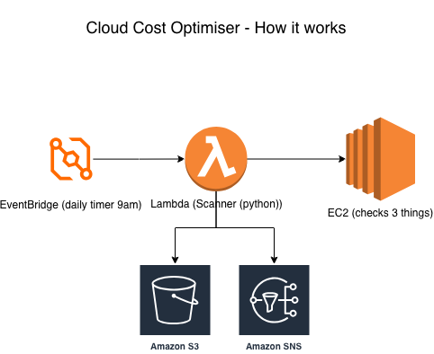

# Cloud Cost Optimiser

A tool that checks my AWS account every day for things that waste money,it also saves a report, and emails me a summary. It runs by itself on a schedule, I don't have to do anything.

## The problem

Cloud accounts quietly waste money on things people forget about, such as storage left behind, servers switched off but still charging, and resources nobody labelled so nobody cleans them up. This tool finds them automatically.

## What it checks

- **Unattached storage** — disks left behind, still being charged for
- **Stopped servers** — switched off, but storage still costs money
- **Untagged servers** — no label = nobody owns it = never cleaned up

## How it works

1. A timer (EventBridge) wakes the tool up once a day
2. The tool (a Lambda function written in Python) checks the account
3. It saves a dated report to storage (S3)
4. It emails me a summary (SNS)
5. Then it switches off until tomorrow

## What I used

- **AWS Lambda** — runs my Python code
- **EventBridge** — the daily timer
- **S3** — stores the reports
- **SNS** — sends the email
- **IAM** — controls what the tool is allowed to do
- **Terraform** — lets me rebuild the whole thing from code

## Choices I made

**I used Lambda instead of a server.** The job takes about 2 seconds a day. A normal server would cost money all day doing nothing. Lambda only runs when needed and costs almost nothing.

**I gave the tool least privilege.** It can only save a report and send an email, nothing else. So even if something went wrong, it couldn't do any damage.

**I set a 30-second time limit.** The job normally takes 2 seconds, so if it ever takes longer than 30, something's wrong and it stops itself instead of running up a bill.

**I kept the storage private.** The reports are internal, so nobody outside can see them. They're saved with the date in the name, so each day's report is kept instead of being overwritten.

## It working

**The daily email summary I receive:**

**The Lambda function running successfully:**

.png)
.png)

**Reports saved in S3, one per day:**

**The whole project built as code (Terraform):**

## What I learned

This was my first hands on AWS project after passing my Solutions Architect Associate exam. I learned how to read errors instead of fearing them,and how to rebuild my whole project from code using Terraform.

## What I'd add next

- Handle very large accounts
- Show the estimated monthly saving for each finding
- Check storage and other resources for missing labels too
